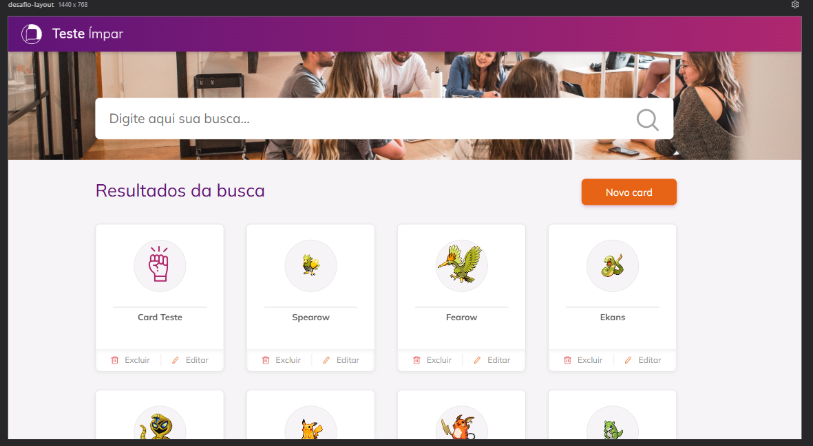
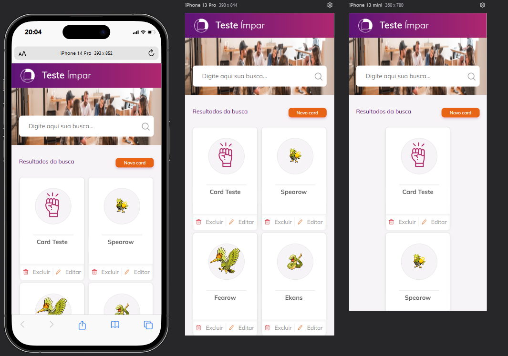

# Desafio replicar layout

### O projeto esta publicado na URL para acesso rapido:
  - https://desafio-cards-impar.netlify.app/

#
### Desafio:
- Foi replicado o layout proposto, seguindo fielmente o design original. Seguindo a base de cores, dimensões, fontes, ícones. 
- Foi desenvolvido pensando na tela proposta no desafio de 1440px seguindo as proporções do original, conforme imagem 1 abaixo.
- Foi também desenvolvido o layout para se comportar adequadamente para mobile em diferentes tamanhos de telas, pensando no conceito de 'mobile-first', conforme imagem 2 abaixo.
- Implementada a possibilidade de criar novos cards, adicionando um titulo e uma imagem, além dos cards já existentes, provenientes da api do pokemon. Esses novos cards serão salvos no local storage, no browser. Quando carregado novamente o navegador, será exibida outra imagem: o ícone padrão como mostrado no layout base.
- É possível deletar todos os cards criados nas configurações do browser.
  - Caso queira deletar os cards salvos, segue os passos:
    - Apertar F12
    - Ir na aba com a opção "Application"
    - No menu de canto esquerdo, selecionar "Local storage", e abrir na seta ao lado
    - Selecionar o site: https://desafio-cards-impar.netlify.app
    - Deletar a key [@cards]

#
## Rodar localmente:

### Como instalar
- Clonar o repositório:
```
  https://github.com/FELIPEMENEGUELI/desafio-cards.git
```

- Acesse a pasta do projeto pelo cmd:
```
  cd desafio-cards
```

- Realizar a instalação das dependências:
```
  npm install ou npm i
```

- Executar o projeto:
```
  npm run dev
```

- [image-1]


- [image-2]
